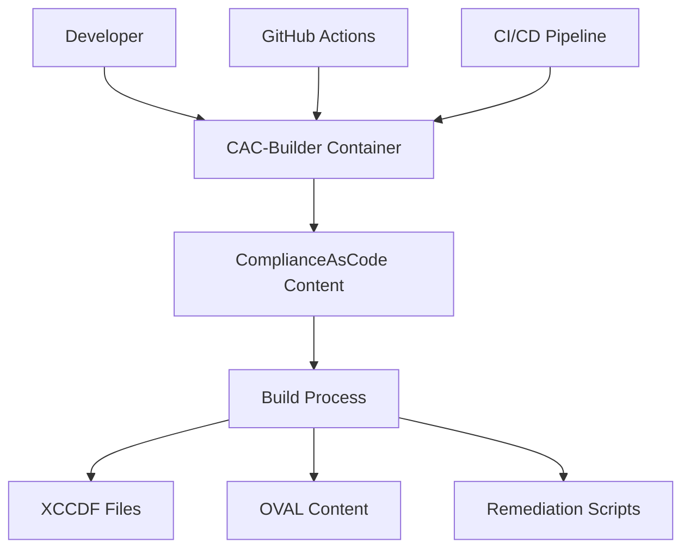

# ComplianceAsCode Builder

Modern containerized build environment for security compliance content

<div class="pt-12">
  <span @click="$slidev.nav.next" class="px-2 py-1 rounded cursor-pointer" hover="bg-white bg-opacity-10">
    Press Space for next slide <carbon:arrow-right class="inline"/>
  </span>
</div>

<div class="abs-br m-6 flex gap-2">
  <a href="https://github.com/mitre/cac-builder" target="_blank" alt="GitHub"
    class="text-xl slidev-icon-btn opacity-50 !border-none !hover:text-white">
    <carbon-logo-github />
  </a>
</div>

---
layout: default
---

# What is ComplianceAsCode?

<div class="grid grid-cols-2 gap-4">
<div>

## Overview
- Security compliance as code
- Defines security policies, benchmarks, and remediations
- Machine-readable security content
- Supports multiple standards and platforms

## Benefits
- Consistent security implementation
- Automated checking and remediation
- Standardized benchmarks
- Reduces manual security work

</div>
<div>

```yaml
benchmark:
  id: rhel9-baseline

  title: RHEL 9 Security Baseline
  description: Security configuration for RHEL 9
  version: 1.0.0

  rules:
    - id: ensure_ssh_key_access_only
      title: Ensure SSH Key Authentication Only
      description: Disable password authentication for SSH
      check: |
        sshd_config_value PasswordAuthentication no
      fix: set_sshd_config PasswordAuthentication no
```

</div>
</div>

---
layout: section
---

# The Challenge

---
layout: default
---

# Building Compliance Content

## The Challenges

<v-clicks>

- Complex build requirements
- Multiple dependencies
- Platform-specific testing
- Certificate complexities
- Inconsistent environments
- Development and CI bottlenecks

</v-clicks>

---
layout: two-cols
---

# Security Benchmarking Reality

<div class="text-sm">

## Traditional Workflow

1. Set up build environment manually
2. Install dependencies (error-prone)
3. Configure certificates & networking
4. Clone multiple repositories
5. Debug build failures
6. Wait ~30-60 minutes for build
7. Troubleshoot content errors

<div class="mt-4 text-xs">
<carbon:warning class="inline text-amber-500"/> Time to first usable content: 1-2 hours<br>
<carbon:warning class="inline text-amber-500"/> Environment consistency issues<br>
<carbon:warning class="inline text-amber-500"/> High cognitive load for new users
</div>

</div>

::right::

<div class="mt-4 text-sm">

## Common Issues

<v-clicks>

- **Environment inconsistencies**  
  "It works on my machine..."

- **Dependency conflicts**  
  Missing or incompatible packages

- **Certificate problems**  
  Corporate networks & proxies

- **Architecture differences**  
  Intel vs ARM platforms

- **Onboarding friction**  
  Days spent on environment setup

</v-clicks>

</div>

---
layout: statement
---

# Enter CAC-Builder

---
layout: two-cols
---

# CAC-Builder Solution

<v-clicks>

- Containerized build environment
- Pre-configured dependencies
- Multi-platform support
- Certificate management
- GitHub Actions integration
- Faster development cycles

</v-clicks>

::right::

<div class="flex justify-center h-full items-center">

</div>

---
layout: default
---

# Architecture

<div class="grid grid-cols-2 gap-4">
<div>

## Components
- Base Fedora container
- CMake build system
- Certificate management
- Content repository
- Build tools & dependencies
- SCAP validation tooling

</div>
<div>



</div>
</div>

---
layout: two-cols
---

# Multi-platform Support

<div class="text-sm">

## Challenge

- ARM64 architecture gaining popularity
- Traditional containers build for one architecture
- Incompatibility between platforms
- Slow emulation on the wrong architecture
- Apple M-series Macs need native containers

</div>

::right::

<div class="text-sm">

## How We Solved It

<v-clicks>

1. QEMU emulation layer in GitHub Actions
2. Docker buildx for multi-platform builds
3. Manifest lists for platform-specific selection
4. Optimized build flags for ARM64
5. Testing across architectures

</v-clicks>

```yaml
# In GitHub Actions workflow
- name: Set up QEMU
  uses: docker/setup-qemu-action@v2
  with:
    platforms: 'arm64,amd64'

- name: Build container
  uses: docker/build-push-action@v4
  with:
    platforms: linux/amd64,linux/arm64
    push: true
```

<div v-click class="text-xs mt-4 border rounded p-2 bg-gray-100">
<carbon:checkmark class="inline text-green-500"/> <strong>Performance Impact:</strong> Native ARM64 builds run 2.5x faster on M1/M2 Macs vs emulated containers.
</div>

</div>

---
layout: default
---

# Key Features

<div class="grid grid-cols-3 gap-4">
<div v-click>

## Build Variants
- **Full**: With pre-built content
- **Minimal**: On-demand builds
- Multi-platform: AMD64 + ARM64

</div>
<div v-click>

## Certificate Management
- Split cert handling for GitHub Actions
- Flexible cert assembly
- Internal CA support
- Automatic validation

</div>
<div v-click>

## CI/CD Integration
- Automated testing
- Build artifact collection
- Container publishing
- Version tagging

</div>
</div>

---
layout: default
---

# Container Usage

```bash
# Pull the container
docker pull ghcr.io/mitre/cac-builder:minimal

# Run with mounted output directory
docker run -it --rm -v $(pwd)/output:/output ghcr.io/mitre/cac-builder:minimal

# Build specific product
docker run -it --rm -v $(pwd)/output:/output ghcr.io/mitre/cac-builder:minimal -c "
  cd /content
  ./build_product rhel9
  cp /content/build/ssg-rhel9-* /output/
"

# Using the full container with pre-built content
docker run -it --rm -v $(pwd)/output:/output ghcr.io/mitre/cac-builder:full -c "
  cp /content/build/ssg-* /output/
  echo 'Content copied to output directory'
"
```

---
layout: two-cols
---

# With CAC-Builder

<div class="text-sm">

## Simplified Workflow

1. Pull the container
   ```bash
   docker pull ghcr.io/mitre/cac-builder:minimal
   ```

2. Generate content
   ```bash
   docker run -v $(pwd)/output:/output \
     ghcr.io/mitre/cac-builder:minimal -c \
     "cd /content && ./build_product rhel9 && \
      cp /content/build/ssg-rhel9-* /output/"
   ```

<div class="mt-4 text-xs">
<carbon:checkmark class="inline text-green-500"/> Time to first usable content: 2 minutes<br>
<carbon:checkmark class="inline text-green-500"/> 100% consistent environment<br>
<carbon:checkmark class="inline text-green-500"/> Works on any platform with Docker
</div>

</div>

::right::

<div class="text-sm">

## Real-world Impact

<v-clicks>

### Before
- Environment setup: 2-4 hours
- First build: 30-60 minutes
- Onboarding a new dev: 1-2 days
- Troubleshooting env issues: 30%+ of time

### After
- Environment setup: 2 minutes
- First build: 5-10 minutes
- Onboarding a new dev: 30 minutes
- Troubleshooting env issues: <5% of time

</v-clicks>

<div v-click class="mt-4 border rounded p-2 bg-gray-100 text-xs">
<p class="font-bold">Case Study: MITRE Security Team</p>
"Using CAC-Builder, our team was able to develop and test custom RHEL security benchmarks in a single day, compared to the previous 3-4 day process."
</div>

</div>

---
layout: center
class: text-center
---

# Certificate Management

---
layout: two-cols
---

# Certificate Challenges

<div class="text-sm">

## The Problem

<v-clicks>

- GitHub's 64KB secret size limitation
- Certificate chains are often larger
- Private certs can't be committed to repo
- Enterprise environments with custom CAs
- Build processes need certificates

</v-clicks>

```javascript
// The Problem: GitHub Secrets Size Limit
// 1. CA bundle is often >64KB
// 2. Cannot exceed GitHub's limit
// 3. Need certificate for builds
```

</div>

::right::

<div class="text-sm">

## Our Approach

<v-clicks>

1. **Split**: Divide certificates into parts
2. **Store**: Save parts as separate GitHub secrets
3. **Assemble**: Reconstruct at build time
4. **Validate**: Verify certificate integrity
5. **Use**: Install in container's CA store

</v-clicks>

```bash
# Split certificate into manageable parts
./scripts/split-cert-for-secrets.sh \
  --parts 5 ./certs/org/ca-bundle.pem
```

<div v-click class="text-xs mt-4 border rounded p-2 bg-gray-100">
Each part maintains proper PEM certificate format for maximum reliability. Parts are automatically assembled at build time.
</div>

</div>

---
layout: default
---

# Certificate Solution in Detail

<div class="grid grid-cols-2 gap-4">
<div>

## Split & Store

```bash
# Split large certificate for GitHub 
./scripts/split-cert-for-secrets.sh \
  --parts 5 ./certs/org/ca-bundle.pem

# Update GitHub secrets via GitHub CLI
./scripts/update-repo-secrets.sh \
  --directory ./split-certs \
  --repo mitre/cac-builder
```

## Reassemble at Build Time

```bash
# Certificate assembly from parts
./scripts/assemble-certificates.sh --verify
```

</div>
<div>

## In the GitHub Workflow

```yaml
- name: Create certificate file for build
  env:
    CA_BUNDLE: ${{ secrets.CA_BUNDLE }}
    CA_BUNDLE_PART1: ${{ secrets.CA_BUNDLE_PART1 }}
    CA_BUNDLE_PART2: ${{ secrets.CA_BUNDLE_PART2 }}
    # ...more parts...
  run: |
    # Use our dedicated assembly script
    ./scripts/assemble-certificates.sh --verify
    
    # Show the assembled certificate info
    ls -la certs/org/
```

</div>
</div>

---
layout: default
class: text-sm
---

# Local GitHub Actions Testing

<div class="grid grid-cols-2 gap-4">
<div>

## Challenge
- GitHub Actions workflows hard to debug
- Certificate handling needs local testing
- Wait time for CI feedback too long
- Environment inconsistencies

## Our Solution

```bash
# Test GitHub Actions locally
./scripts/test-github-actions.sh \
  --workflow publish-container.yml \
  --arch arm64 \
  --fix-socket
```

</div>
<div>

## Key Features

<div class="ml-4">

- **Multiple Architectures**: Test on amd64/arm64
- **Certificate Simulation**: Test with dummy certs
- **Docker Socket Handling**: Fixes common Docker issues
- **MacOS Compatibility**: Works on M1/M2 Macs
- **Detailed Debugging**: Step-by-step output

</div>

<v-click>
<div class="text-xs mt-4 border rounded p-2 bg-gray-100">
<carbon:checkmark class="inline text-green-500"/> Reduces debugging time by 95%<br>
<carbon:checkmark class="inline text-green-500"/> Catches issues before they hit production<br>
<carbon:checkmark class="inline text-green-500"/> Enables cross-platform testing locally
</div>
</v-click>

</div>
</div>

---
layout: default
---

# Workflow Automation

<div class="grid grid-cols-2 gap-4">
<div>

## CI/CD Pipeline
<v-clicks>

- Automatic certificate assembly
- Multi-platform builds via QEMU
- Artifact collection and retention
- Cross-platform container publishing
- Automatic image visibility management  

</v-clicks>

</div>
<div>

## Build Artifact Collection

```yaml
- name: Save build artifacts
  uses: actions/upload-artifact@v3
  with:
    name: cac-test-content
    path: |
      output/*.xml
      output/*.xccdf.xml
      output/*.ds.xml
      output/build-info.txt
    retention-days: 14
```

<div v-click class="text-xs mt-4">
The workflow generates detailed build info:
- Build timestamp and environment
- File listings with sizes and types
- Commit information for traceability
- Performance metrics
</div>

</div>
</div>

---
layout: default
---

# Real-world Developer Workflow

<div class="text-sm">

## Compliance Content Development with CAC-Builder

<div class="grid grid-cols-2 gap-4">
<div>

### Development
1. Mount local content directory
   ```bash
   docker run -v $(pwd):/local -it \
     ghcr.io/mitre/cac-builder:minimal
   ```

2. Develop & test with immediate feedback
   ```bash
   # Inside container
   cd /local
   ./build_product rhel9
   ```

3. Push changes to repository
   ```bash
   git commit -am "Add new RHEL9 rule"
   git push
   ```

</div>
<div>

### CI/CD Integration
4. GitHub Actions builds and tests
   ```yaml
   - name: Build container
     uses: docker/build-push-action@v4
     with:
       platforms: linux/amd64,linux/arm64
   ```

5. Artifact collection
   ```yaml
   - name: Save build artifacts
     uses: actions/upload-artifact@v3
   ```

6. Testing & verification
   ```bash
   # Download and use the artifacts
   oscap xccdf eval ./output/ssg-rhel9-ds.xml
   ```

</div>
</div>
</div>

<div v-click class="mt-4 text-sm">
<p class="font-bold">Integration with existing Security Workflows</p>
<div class="grid grid-cols-2 gap-2 text-xs">
<div>
<ul>
<li>Security scanners consume output XML</li>
<li>CI/CD pipelines trigger compliance checks</li>
<li>Delta reporting between container builds</li>
</ul>
</div>
<div>
<ul>
<li>Content development/testing separated</li>
<li>Consistent testing environments</li>
<li>Version-controlled security policies</li>
</ul>
</div>
</div>
</div>

---
layout: section
---

# Future Developments

---
layout: default
---

# Roadmap

<div class="grid grid-cols-3 gap-4">
<div v-click>

## Short Term
- Windows container support
- Test result visualization
- Enhanced validation rules
- More build automation

</div>
<div v-click>

## Medium Term  
- Content browsing UI
- Result comparison features
- Extended platform coverage
- Custom policy templates

</div>
<div v-click>

## Long Term
- Integration with remediation systems
- Compliance scoring dashboards 
- Container hardening profiles
- Community content library

</div>
</div>

---
layout: center
class: text-center
---

# Questions?

[GitHub Repository](https://github.com/mitre/cac-builder) · [Documentation](https://mitre.github.io/cac-builder/)

---
layout: end
---

# Thank You!
